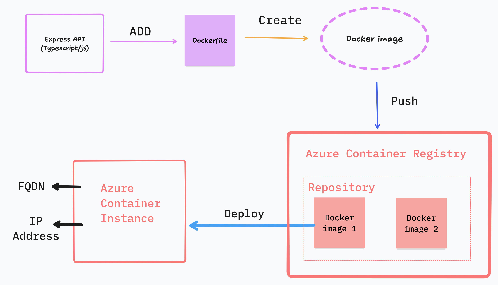

## Deploy your Express API to Azure Container Instance using Azure Container Registry (ACR) & Docker



Easily deploy your Express API to Azure using Docker, Azure Container Registry (ACR), and Azure Container Instances (ACI). This guide walks you through the entire process, from creating a Docker image to running your API in Azure.

## Features
- Dockerized Deployment: Create a Docker image for your API using a Dockerfile.
- Azure Container Registry (ACR): Push your Docker image to Azure's secure container registry.
- Azure Container Instances (ACI): Deploy and run your API as a lightweight, standalone container in Azure.

## Prerequisites
Azure CLI installed locally
Docker installed and configured
Azure account with sufficient permissions

## Follow these steps:

- Create a Dockerfile

Add a Dockerfile to your project's root directory:

```Dockerfile
# get node image from docker hub
FROM node:20-alpine

# create a directory /app in container
WORKDIR /app

# copy package.json and package-lock.json to /app in container
COPY package*.json .

# install dependencies
RUN npm install 

# copy all files from current directory to /app in container
COPY . .

# build the app(compile the typescript code to javascript)
RUN npm run build

# expose port
EXPOSE 80

# start the app
CMD [ "npm", "start" ]
```
- For this demo, stick to port 80. 

- Build the Docker image

```bash
docker build -t <your-docker-image-name> .
```
Example:
```bash
docker build -t simple-app .
```

- Run the image locally

```bash
docker run -p 80:80 <your-docker-image-name>
```
Example:
```bash
docker run -p 80:80 simple-app
```

- Provision Azure Container Registry (ACR) on the Azure portal
- Registry name: <a_unique_name>

- Login to Azure locally via Azure CLI (make sure you have Azure CLI installed locally)
```sh
az login 
```
A browser will open, and you will be prompted to log in to your Azure account.

- Login to Azure Container Registry

```sh
az acr login --name <your-acr-name>
```
Example:
```sh
az acr login --name simpleappregistry
```

- Tag the image (preparation for pushing to ACR)

```bash
docker tag <your-docker-image-name> <your-acr-name>.azurecr.io/<your-docker-image-name>
```
Example:
```bash
docker tag simple-app simpleappregistry.azurecr.io/simple-app
```

- Push the image to ACR

```bash
docker push <your-acr-name>.azurecr.io/<your-docker-image-name>
```
Example:
```bash
docker push simpleappregistry.azurecr.io/simple-app
```

On Azure Container Registry, the image should be visible.

- Go to settings, access keys, and enable the admin user or run the following command to enable the admin user

```sh
az acr update --name <your-acr-name> --admin-enabled true
```
Example:
```sh
az acr update --name simpleappregistry --admin-enabled true
```

- Provision Azure Container Instance on the Azure portal (ACI) - meant to run the container image
    - Container name: <a_unique_name>
    - Image source: Azure Container Registry
    - Registry: <your-acr-name> (e.g., simpleappregistry)
    - Image: <your-docker-image-name> (e.g., simple-app)
    - OS type: Linux
    - Size: 1.5 GB
    - Network: public
    - DNS name label: <a_unique_name> (e.g., simpleappdns)
    - Port: 80
    - Protocol: TCP

- Click on Review + create and then create